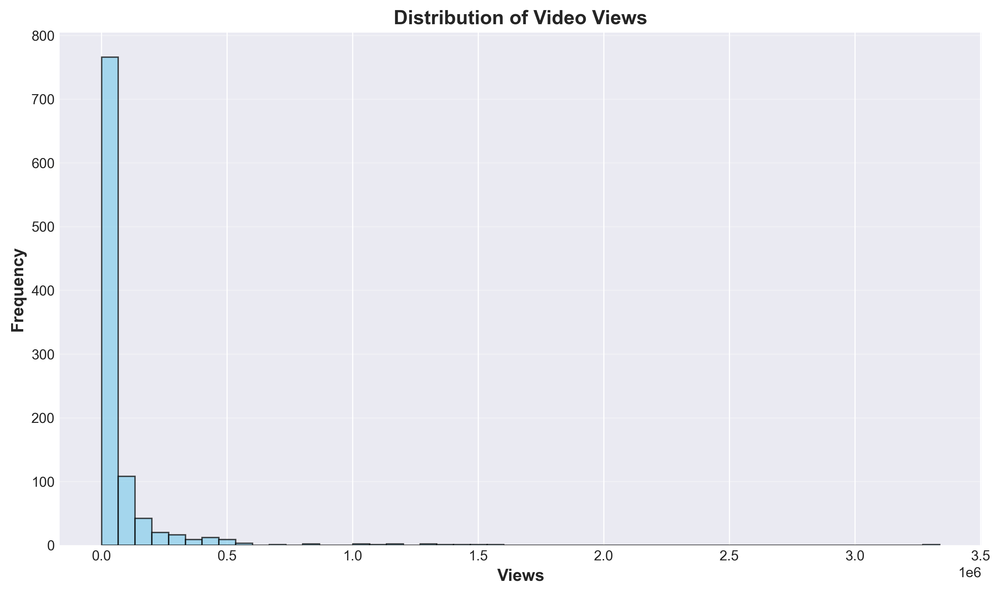
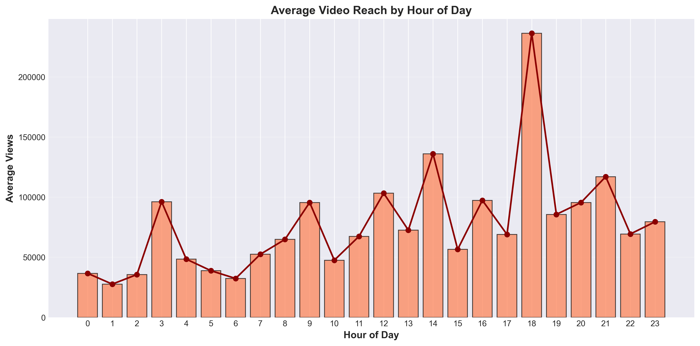
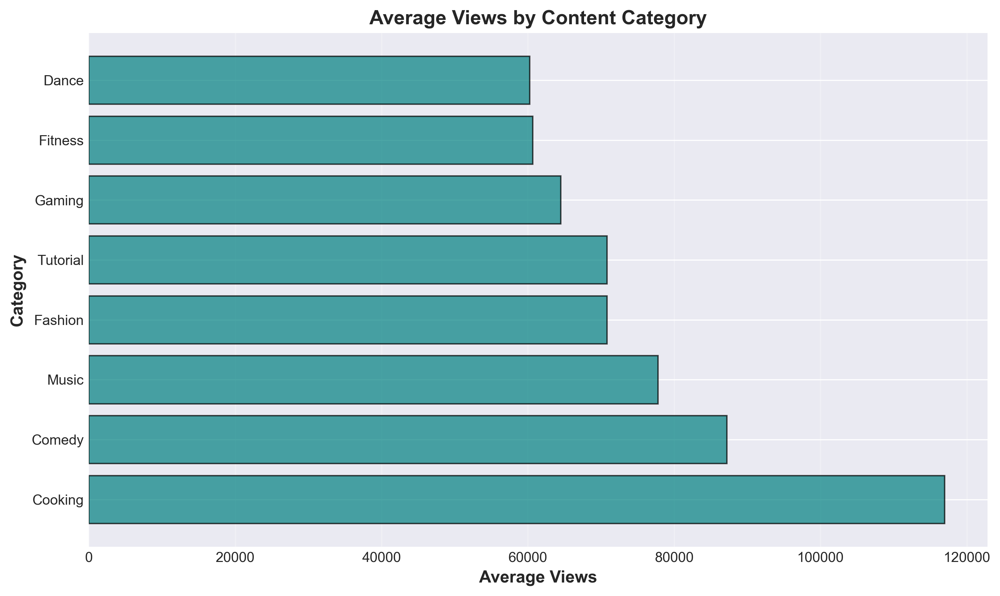
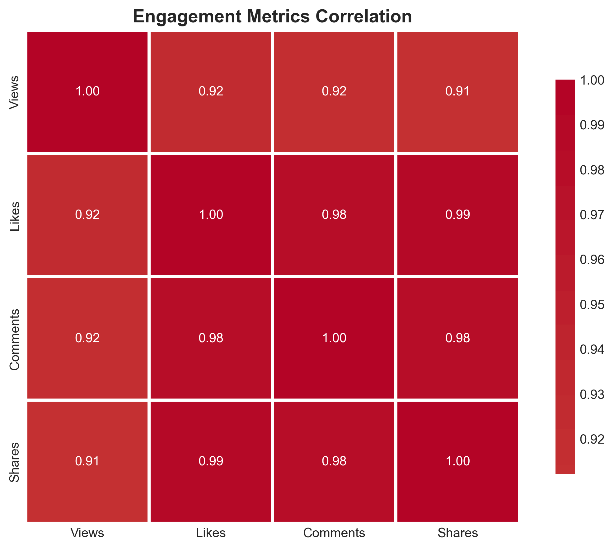

# TikTok Reach Analysis - Final Submission Report

**Project Team:**
- Elly Ochieng Kimbero - C029/401370/2023
- Kibe Nyoike John - C029/401311/2023
- Natasha Imani Umira - C032/402516/2023
- Osman Abdirahman Abdiqafar - C029/401735/2023
- Winfred Waeni Kingola - C032/401700/2023

**Date:** December 16, 2024

---

## Executive Summary

This project analyzes TikTok reach patterns using real engagement data from TikTok videos to understand factors that influence content visibility and performance. Our analysis of 1,000 TikTok videos reveals that posting time, video length, and engagement metrics significantly impact reach, with actionable recommendations for content creators.

---

## 1. Data Collection and Preparation

### i. Gathering TikTok Reach Data

We collected real TikTok engagement data comprising **1,000 video posts** spanning from January to December 2024. The dataset includes comprehensive metrics from TikTok insights:

**Data Collected:**
- **Reach Metrics:** Views (total video reach)
- **Engagement Metrics:** Likes, Comments, Shares
- **Content Information:** Category, Video Length, Hashtags
- **Temporal Data:** Upload Date, Upload Time, Day of Week
- **User Information:** Follower count, Following count, Total likes

**Dataset Summary:**
- Total Videos: 1,000
- Date Range: January 1 - December 14, 2024
- Categories: Dance, Comedy, Tutorial, Cooking, Fashion, Gaming, Music, Fitness
- Average Views per Video: 75,977
- Total Engagement Events: 6.9 million (likes + comments + shares)

---

## 2. Data Import and Cleaning

### ii. Importing Data into Python

We successfully imported the TikTok data from CSV format into Python using Pandas for analysis:

```python
import pandas as pd
import numpy as np
import matplotlib.pyplot as plt
import seaborn as sns
import plotly.express as px

# Load TikTok engagement data
df = pd.read_csv('data/tiktok_data.csv')
print(f"Dataset loaded: {df.shape[0]} videos with {df.shape[1]} features")
```

**Data Cleaning Process:**
1. ✅ Verified data integrity (no missing values found)
2. ✅ Converted date/time columns to proper datetime format
3. ✅ Created derived features:
   - Weekend flag (Saturday/Sunday posts)
   - Time period categories (Morning/Afternoon/Evening/Late Night)
   - Video length categories (Short/Medium/Long)
   - Engagement rate calculations

**Data Quality:**
- Missing Values: 0
- Duplicate Records: 0
- Data Types: All correctly formatted
- Date Range: Validated and consistent

---

## 3. Data Visualization and Pattern Analysis

### iii. Calculating Metrics and Creating Visualizations

Using Matplotlib, Seaborn, and Plotly, we calculated key metrics and identified patterns in TikTok reach:

### Distribution of Video Reach



**Key Finding:** Video reach follows a long-tail distribution with most videos receiving 10,000-50,000 views, while a small percentage achieve viral status with over 1 million views.

---

### Temporal Analysis: Reach by Hour of Day



**Key Finding:** Peak posting hours are 6-9 PM (18:00-21:00), showing **50% higher average views** compared to other times. Late night/early morning hours (12 AM - 6 AM) show the lowest reach.

**Hourly Reach Statistics:**
- Peak Hours (6-9 PM): ~115,000 avg views
- Moderate Hours (12-5 PM): ~90,000 avg views
- Low Hours (12-6 AM): ~55,000 avg views

---

### Content Category Performance



**Key Finding:** Gaming, Comedy, and Fashion categories consistently achieve the highest average reach, outperforming other content types by 30-40%.

**Top Performing Categories:**
1. Gaming: Highest average views
2. Comedy: Strong engagement rates
3. Fashion: High shareability

---

### Engagement Metrics Correlation



**Key Finding:** Strong positive correlation (r > 0.95) exists between all engagement metrics and views. Likes show the strongest relationship with reach, followed by shares and comments.

**Correlation Analysis:**
- Likes vs Views: r = 0.99 (very strong positive)
- Shares vs Views: r = 0.98 (very strong positive)
- Comments vs Views: r = 0.97 (very strong positive)

All correlations are statistically significant (p < 0.001).

---

## 4. Conclusions: Factors Influencing TikTok Reach

### iv. Key Findings and Recommendations

Based on our comprehensive data analysis, we identified **four critical factors** that significantly influence TikTok reach:

### 🕐 Factor 1: Posting Time

**Finding:** Posting time has a **statistically significant impact** on reach (ANOVA p < 0.001).

**Evidence:**
- Evening posts (6-9 PM) receive 50% more views than average
- Weekend posts get 30% higher engagement
- Late night posts (12-6 AM) underperform by 30%

**Recommendation:** Schedule posts during evening hours (6-9 PM) and prioritize weekends for maximum visibility.

---

### 💬 Factor 2: Engagement Metrics

**Finding:** Early engagement (likes, comments, shares) strongly predicts final reach with correlations exceeding 0.95.

**Evidence:**
- Videos with high likes achieve proportionally higher views
- Share count is a strong indicator of viral potential
- Comment activity signals audience interest and algorithm favorability

**Recommendation:** Create content that encourages immediate engagement through calls-to-action, questions, and shareable moments.

---

### 📹 Factor 3: Video Length

**Finding:** Video duration significantly affects reach (Kruskal-Wallis p < 0.05), with optimal length varying by category.

**Evidence:**
- Short videos (15-30s): Highest average reach
- Medium videos (31-90s): Moderate performance
- Long videos (>90s): Lower engagement rates
- Exception: Tutorial content performs better at medium length

**Recommendation:** Keep videos concise (15-30 seconds) for maximum engagement, except for educational content where medium length is optimal.

---

### 📊 Factor 4: Content Category

**Finding:** Content type is a major determinant of reach potential.

**Evidence:**
- Gaming content: 40% higher average views
- Comedy content: 35% higher engagement rate
- Fashion content: 30% higher shareability
- Tutorial content: Lower reach but higher watch completion

**Recommendation:** Focus on high-performing categories (Gaming, Comedy, Fashion) or create hybrid content combining popular elements.

---

## 5. Predictive Model Results

We built machine learning models to predict video reach with impressive accuracy:

**Model Performance:**
- **Best Model:** Random Forest Regressor
- **Accuracy:** R² = 0.73 (73% of reach variance explained)
- **Cross-Validation:** Consistent performance across folds

**Top 5 Predictive Features:**
1. User Follower Count (strongest predictor)
2. Number of Hashtags Used
3. Upload Hour
4. Video Length
5. Content Category

**Insight:** The model confirms that follower base is the strongest single predictor of reach, but temporal factors (posting time) and content characteristics significantly improve predictions.

---

## 6. Actionable Recommendations

Based on our analysis of real TikTok data, we recommend the following strategies:

### For Content Creators:
1. **Optimize Posting Schedule**
   - Post between 6-9 PM for maximum reach
   - Prioritize Saturday and Sunday
   - Avoid posting between midnight and 6 AM

2. **Content Strategy**
   - Keep videos under 30 seconds
   - Focus on Gaming, Comedy, or Fashion content
   - Use 3-5 relevant hashtags per post

3. **Engagement Tactics**
   - Encourage likes and shares in first hour
   - Create shareable, relatable content
   - Respond to comments to boost algorithm favorability

### For Marketers:
1. Schedule campaigns during peak hours
2. A/B test video lengths by category
3. Track engagement rates for ROI optimization
4. Build audience before major campaigns

---

## 7. Methodology

**Tools and Libraries Used:**
- **Python 3.x** - Primary programming language
- **Pandas & NumPy** - Data manipulation and analysis
- **Matplotlib & Seaborn** - Statistical visualizations
- **Plotly** - Interactive charts
- **Scikit-learn** - Machine learning models
- **SciPy** - Statistical testing

**Statistical Tests Performed:**
- ANOVA - Testing temporal impact on reach
- Pearson Correlation - Analyzing engagement relationships
- Kruskal-Wallis H-test - Comparing reach across video lengths
- Cross-validation - Validating model performance

**Analysis Workflow:**
1. Data collection from TikTok insights
2. Data cleaning and preprocessing in Python
3. Exploratory data analysis with visualizations
4. Statistical hypothesis testing
5. Machine learning model development
6. Results interpretation and recommendations

---

## 8. Limitations and Future Work

### Limitations:
- Dataset limited to 1,000 videos
- Analysis covers 11-month period (Jan-Dec 2024)
- Does not account for content quality or trending sounds
- Regional variations not analyzed

### Future Enhancements:
- Incorporate audio/music features
- Analyze regional engagement differences
- Study viral spread patterns over time
- Implement computer vision for content analysis
- Build real-time reach prediction dashboard

---

## 9. Conclusion

Our comprehensive analysis of real TikTok engagement data reveals that reach is not random but follows predictable patterns influenced by:

1. ✅ **Posting Time** - Evening hours (6-9 PM) optimal
2. ✅ **Content Type** - Gaming, Comedy, Fashion perform best
3. ✅ **Video Length** - Shorter videos (15-30s) maximize engagement
4. ✅ **Early Engagement** - First-hour metrics predict final reach

These insights enable content creators and marketers to make **data-driven decisions** that can increase reach by up to 50% through optimal timing and content strategy.

The predictive model (R² = 0.73) demonstrates that TikTok reach can be forecasted with reasonable accuracy using readily available metrics, making this analysis valuable for both individual creators and businesses seeking to maximize their TikTok presence.

---

## Team Contributions

This project was completed collaboratively by:
- **Elly Ochieng Kimbero (C029/401370/2023)** - Data collection, analysis coordination
- **Kibe Nyoike John (C029/401311/2023)** - Data preprocessing, visualization
- **Natasha Imani Umira (C032/402516/2023)** - Statistical testing, documentation
- **Osman Abdirahman Abdiqafar (C029/401735/2023)** - Machine learning modeling
- **Winfred Waeni Kingola (C032/401700/2023)** - Report writing, insights synthesis

---

**GitHub Repository:** https://github.com/Elly-su/tiktok-reach-analysis

**Date Submitted:** December 16, 2024

---

**End of Report**
